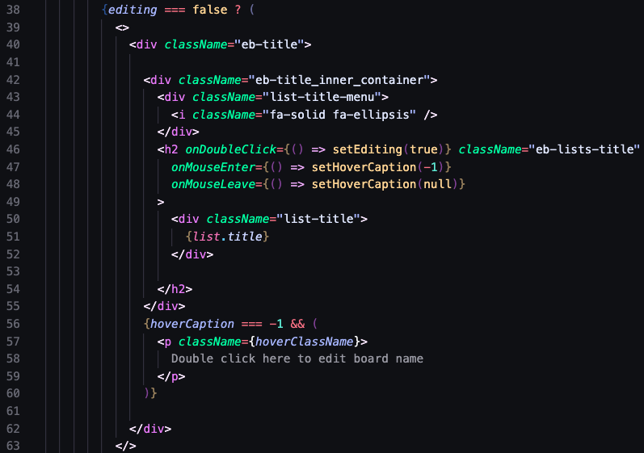

# Space Odyssey

<!-- insert database schema design under an images folder that is located directly under the parent route -->

## About

- View our live site!

  https://persistentpythons.onrender.com/

* "Space Odyssey" is a space-themed project management platform inspired by Trello. Users navigate through tasks and projects in a cosmic setting, organizing their work into missions. Teams, collaborate on missions using customizable boards, lists and cards, each with detailed information. "Space Odyssey" offers a seamless and secure way for users to manage their projects across the cosmos while enjoying a visually captivating experience.

- Technologies Used

  - Python with Flask to create a RESTful API
  - Implement endpoints for user authentication, managing boards, cards, and lists, etc
  - Defined SQLAlchemy models to represent users, boards, etc
  - Create migration scripts using tools like Alembic to manage database schema changes
  - Develop the user interface using React components
  - Used Redux to manage application state, including user authentication status, and UI states
  - Implemented routing using React Router to navigate between different views
  - Implemented AWS for seamless image upload integration

<!-- Insert discussion of two features to show off teams technical abilities -->

## Showcase features

- Card component modal

- Implementing AWS for card-images post

## Conquest of Challenges

<!-- Discussion of challenges faced and the way the team solved them -->

- Figuring out how to return data uniformly in a way that works for each page

- Time management became relevant towards the end of the week, as we were not accomplishing as much as we had wanted to. We all started to feel the pressure, in that moment we decided to split up to make up for lost time

## Code Snippets

<!-- insert a few code snippets highlighting best code -->



- Once created, fields on the website are accessible to be edited by double clicking. We are also looking for users to be notified upon their interaction with these fields using React's mouse events, which is why we are using mouse enter and mouse leave to notify captions and provide a more intuitive experience.

## API Documentation

<!-- Insert discussion of two features to show off teams technical abilities -->

### Get the current user's board

Returns the board created by the current user.

- Require Authentication: True
- Request

  - Method: GET
  - URL: /api/boards
  - Body: none

- Successful Response when there is a logged in user

  - Status Code: 200
  - Headers:
    - Content-Type: application/json
  - Body:

    ```json
    {
      "board": {
        "id": 1,
        "user_id": 1,
        "board_name": "Taco Palace"
      }
    }
    ```

### Create a board

Creates and returns a new board.

- Require Authentication: True
- Request

  - Method: (GET & ) POST
  - URL: /api/boards/new
  - Headers:
    - Content-Type: application/json
  - Body:

    ```json
    {
      "board_name": "Orange Chicken"
    }
    ```

- Successful Response

  - Status Code: 201
  - Headers:
    - Content-Type: application/json
  - Body:

    ```json
    {
      "id": 2,
      "user_id": 1,
      "board_name": "Orange Chicken",
      "createdAt": "2021-11-19 20:39:36",
      "updatedAt": "2021-11-19 20:39:36"
    }
    ```

- Error Response: Body validation error

  - Status Code: 400
  - Headers:
    - Content-Type: application/json
  - Body:

    ```json
    {
      "message": "Bad Request", // (or "Validation error" if generated by Sequelize),
      "errors": {
        "board_name": "Board name is required"
      }
    }
    ```

- Error response: Couldn't find a Board with that specified id

  - Status Code: 404
  - Headers:
    - Content-Type: application/json
  - Body:

    ```json
    {
      "message": "Board couldn't be found"
    }
    ```

### Edit a Board

Updates and returns an existing Board.

- Require Authentication: True
- Require proper authorization: Board must belong to the current user
- Request

  - Method: (GET & ) PUT
  - URL: /api/boards/:boardId
  - Headers:
    - Content-Type: application/json
  - Body:

    ```json
    {
      "board_name": "Orange Chicken"
    }
    ```

- Successful Response

  - Status Code: 200
  - Headers:
    - Content-Type: application/json
  - Body:

    ```json
    {
      "id": 2,
      "user_id": 1,
      "board_name": "Orange Chicken",
      "createdAt": "2021-11-19 20:39:36",
      "updatedAt": "2021-11-19 20:39:36"
    }
    ```

- Error Response: Body validation error

  - Status Code: 400
  - Headers:
    - Content-Type: application/json
  - Body:

    ```json
    {
      "message": "Bad Request", // (or "Validation error" if generated by Sequelize),
      "errors": {
        "message": "Board couldn't be found"
      }
    }
    ```

- Error response: Couldn't find a Board with the specified id

  - Status Code: 404
  - Headers:
    - Content-Type: application/json
  - Body:

    ```json
    {
      "message": "Board couldn't be found"
    }
    ```

### Delete a Board

Deletes an existing board.

- Require Authentication: true
- Require proper authorization: Board must belong to the current user
- Request

  - Method: DELETE
  - URL: /api/boards/:boardId
  - Body: none

- Successful Response

  - Status Code: 200
  - Headers:
    - Content-Type: application/json
  - Body:

    ```json
    {
      "message": "Successfully deleted"
    }
    ```

- Error response: Couldn't find a Board with the specified id

  - Status Code: 404
  - Headers:
    - Content-Type: application/json
  - Body:

    ```json
    {
      "message": "Board couldn't be found"
    }
    ```

### Feature 2
